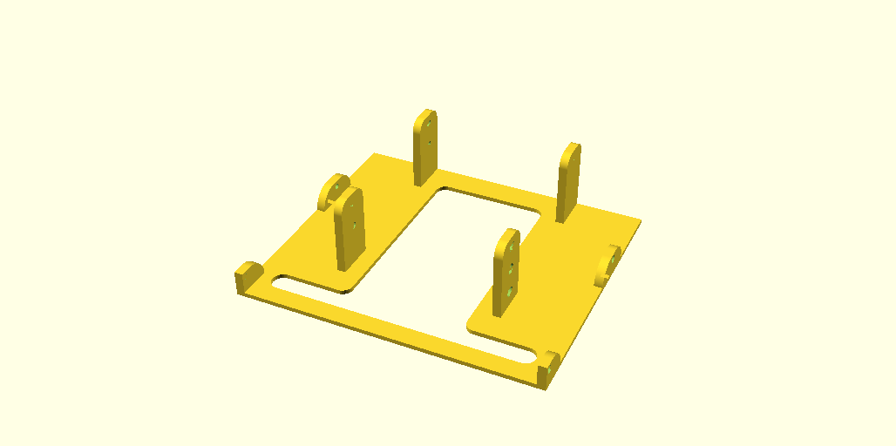

Dell T420 5.25" Bay Drive Bracket
=================================

A model that allows to mount three 2.5" SATA SSD drives (e.g. [Samsung 870 EVO](https://www.samsung.com/uk/memory-storage/sata-ssd/870-evo-1tb-sata-3-2-5-ssd-mz-77e1t0b-eu/)) inside [Dell T420](https://www.dell.com/support/home/en-ae/product-support/product/poweredge-t420) 5.25" bay blank (also works for [Dell T620](https://www.dell.com/support/home/en-ae/product-support/product/poweredge-t620)).

This model was also published on Printables ([link](https://www.printables.com/model/396196-dell-t420-525-bay-drive-bracket)).

Suggested Printing Settings
---------------------------

| Parameter | Value | Notes |
| --------- | ----- | ----- |
| Material  | PLA+  | [eSUN PLA+](https://www.esun3d.com/pla-pro-product/) was used for test prints |
| Printing Temperature | 120 °C | - |
| Build Plate Temperature | 60 °C | - |
| Build Plate Adhesion Type | Skirt / Brim | - |
